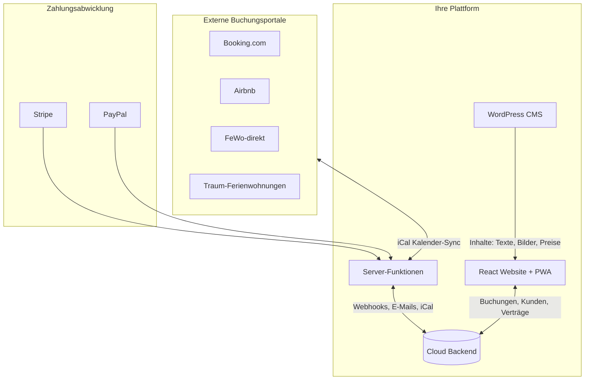
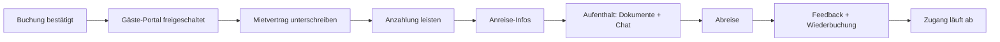
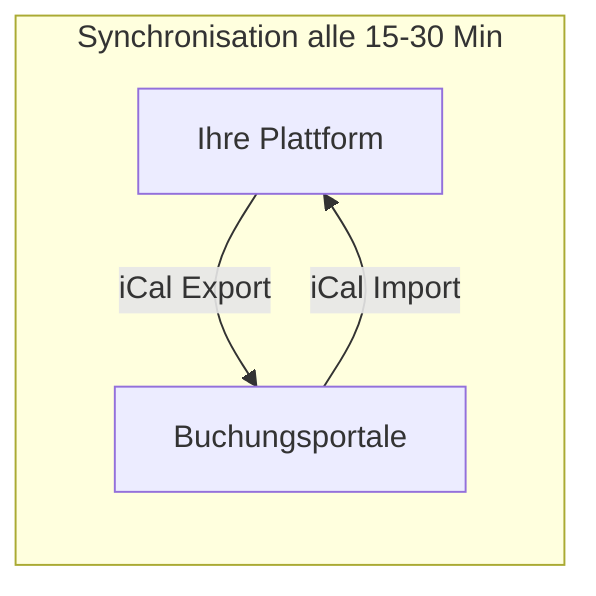

# Ferienhaus-Vermietungsplattform mit WordPress & Gäste-PWA

## Überblick

Eine vollständige Lösung für Ihre Ferienhausvermietung bestehend aus drei Hauptbereichen:

1. **Öffentliche Website** — Präsentation, Buchungsanfragen, Verfügbarkeitskalender
2. **Gäste-Portal (PWA)** — Digitaler Mietvertrag, Hausordnung, Kommunikation, Wiederbuchung
3. **Vermieter-Dashboard** — Buchungsverwaltung, Kundenkommunikation, Rechnungen, Content-Pflege

---

## Architektur & Datenfluss

---

## Bereich 1: Öffentliche Website

### Startseite & Präsentation
- Bildergalerie mit großformatigen Fotos Ihres Ferienhauses
- Beschreibungstexte, Ausstattung, Lage
- Interaktive Karte mit Umgebung

### Verfügbarkeitskalender
- Übersichtlicher Kalender zeigt freie/belegte Zeiträume
- Automatische Synchronisation mit Booking.com, Airbnb etc. via iCal
- Saisonale Preisanzeige (Hauptsaison, Nebensaison, Feiertage)

### Buchungsanfrage
- Datumsauswahl mit sofortiger Preisberechnung
- Kontaktformular für Anfragen
- Optional: Direkte Anzahlung via Stripe/PayPal

### Inhalte aus WordPress
- Texte und Bilder pflegen Sie bequem in WordPress
- Preistabellen und Saisonzeiten
- Hausordnung, Anreiseinformationen
- Lokale Veranstaltungen und Ausflugstipps

---

## Bereich 2: Gäste-Portal (Progressive Web App)

Eine App-ähnliche Erfahrung, die Gäste auf ihrem Smartphone installieren können.

### Vor dem Urlaub
- Persönlicher Zugangsbereich nach Buchungsbestätigung
- **Digitaler Mietvertrag** — ausfüllen und unterschreiben
- Anzahlung/Restzahlung online leisten
- Anreiseinformationen und Kontaktdaten

### Während des Aufenthalts
- **Kurtaxen-Ausweise** als digitale Dokumente
- Hausordnung und WLAN-Zugangsdaten
- Lokale Veranstaltungen und Empfehlungen
- Direkter Chat mit Ihnen bei Fragen

### Nach dem Urlaub (zeitlich begrenzter Zugang)
- Feedback-Formular
- Erneute Buchungsmöglichkeit
- **Spezielle Wiederkommer-Angebote** sichtbar
- Zugang endet automatisch nach definiertem Zeitraum

---

## Bereich 3: Vermieter-Dashboard (Mobile-optimiert)

### Buchungsverwaltung
- Übersicht aller Buchungen (bestätigt, angefragt, storniert)
- Kalenderansicht mit allen Quellen (Direkt, Booking, Airbnb etc.)
- Buchungsdetails bearbeiten

### Kundenverwaltung
- Kundendatenbank mit Buchungshistorie
- Wiederkehrende Gäste markieren
- Notizen und Kommunikationsverlauf

### Kommunikation
- Nachrichten an Gäste senden
- Automatische E-Mails (Buchungsbestätigung, Zahlungserinnerung, Anreiseinfo)
- Benachrichtigungen bei neuen Anfragen/Nachrichten

### Finanzen
- **Rechnungserstellung** mit Kundendaten
- Rechnungsversand per E-Mail
- Zahlungsstatus verfolgen
- Zahlungserinnerungen automatisch oder manuell senden

### Content-Pflege (via WordPress)
- Bilder hochladen und verwalten
- Texte bearbeiten
- **Saisonpreise definieren** (Zeiträume + Preise)
- Veranstaltungen und Tipps aktualisieren

---

## Portal-Synchronisation via iCal

### So funktioniert es
1. Ihre Plattform generiert einen **iCal-Feed** mit allen Buchungen
2. Diesen Feed importieren Sie einmalig in Booking.com, Airbnb, FeWo-direkt etc.
3. Umgekehrt importiert Ihre Plattform die iCal-Feeds der Portale
4. Synchronisation erfolgt alle 15-30 Minuten

### Was synchronisiert wird
- Belegte Zeiträume (keine Doppelbuchungen)
- Buchungsnamen als Referenz

### Was NICHT automatisch synchronisiert wird
- Preise (müssen Sie in jedem Portal separat pflegen)
- Detaillierte Gästedaten (kommen erst bei Direktbuchung)

---

## Zahlungsabwicklung

### Stripe
- Kreditkartenzahlung
- SEPA-Lastschrift
- Sofortüberweisung
- Automatische Zahlungsbestätigungen

### PayPal
- PayPal-Konto oder Gast-Zahlung
- Käuferschutz für Gäste

### Ablauf
1. Gast bucht und wählt Zahlungsart
2. Anzahlung wird verarbeitet
3. Automatische Erinnerung für Restzahlung
4. Sie erhalten Benachrichtigung bei Zahlungseingang

---

## Benachrichtigungen

Sie erhalten Benachrichtigungen bei:
- Neuen Buchungsanfragen
- Bestätigten Buchungen
- Eingegangenen Zahlungen
- Neuen Nachrichten von Gästen
- Unterschriebenen Mietverträgen

Versand via E-Mail (optional: Browser-Push-Benachrichtigungen)

---

## WordPress-Integration im Detail

WordPress dient als Ihr **Content-Management-System**:

| WordPress verwaltet | React-App zeigt an |
|--------------------|--------------------|
| Hausbilder & Galerie | Bildergalerie auf Website |
| Beschreibungstexte | Startseite & Info-Bereiche |
| Preistabellen & Saisons | Preisrechner & Kalender |
| Hausordnung | Gäste-Portal Dokumente |
| Veranstaltungen | Tipps für Gäste |

Die React-App (Website + PWA) holt sich diese Inhalte automatisch aus WordPress und zeigt sie an. Änderungen in WordPress sind sofort auf der Website sichtbar.

---

## Technische Umsetzung

### Phase 1: Grundgerüst
- WordPress-Anbindung einrichten
- Cloud Backend für Buchungsdaten
- Grundstruktur Website + Dashboard

### Phase 2: Buchungssystem
- Verfügbarkeitskalender
- Buchungsformular mit Preisberechnung
- iCal Import/Export für Portal-Sync

### Phase 3: Zahlungen
- Stripe-Integration
- PayPal-Integration
- Rechnungsgenerierung

### Phase 4: Gäste-Portal (PWA)
- Login-Bereich für Gäste
- Digitaler Mietvertrag
- Dokumentenbereich
- Chat-Funktion

### Phase 5: Vermieter-Dashboard
- Buchungsübersicht
- Kundenverwaltung
- Kommunikationszentrale
- Benachrichtigungen

---

## Wichtige Hinweise

**iCal-Synchronisation:** Die Kalender-Synchronisation mit den großen Portalen funktioniert zuverlässig für die Verfügbarkeit. Preise müssen Sie jedoch in jedem Portal separat pflegen — eine vollautomatische Preisverteilung würde offizielle API-Partnerschaften erfordern.

**WordPress:** Da Sie noch keine WordPress-Seite haben, müssten Sie zunächst WordPress bei einem Hoster einrichten (z.B. All-Inkl, IONOS, oder WordPress.com). Ich kann dann die Verbindung herstellen und die React-App darauf aufbauen.

**Progressive Web App:** Die Gäste-App lässt sich auf dem Smartphone-Homescreen installieren und fühlt sich wie eine echte App an — ohne App Store.